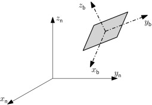

# Introduction
## Abstract
This library is mainly based on the work of **Geir Istad** and is now published as a pip installable library. The library aims to facilitate working with vectors and quaternions while working with IMU.

## Functions
This library contains the following functions:
* Quaternion:
    * get_product (returns the product of the current quaternion with another quaternion)
    * get_conjugate (returns the conjugate of the quaternion)
    * get_magnitude (returns the magnitude of the quaternion)
    * normalize (normalizes the quaternion)
    * get_normalized (returns the normalized quaternion)
* XYZVector:
    * get_magnitude (returns the magnitude of the vector)
    * normalize (normalizes the vector)
    * get_normalized (returns the normalized vector)
    * rotate (rotates the vector according to a quaternion)
    * get_rotated (returns the rotated vector, according to a quaternion)

## Rotation
In various problems, specially in IMU usages, the rotation of a vector using a quaternion is needed. For example, the acceleration obtained from the IMU is a "body-frame" vector, meaning that its values are according to the IMU axes.
However, in an inertial navigation system (INS), access to a world-frame acceleration vector is crucial. The following image depicts the world-frame and body-frame axes:

The rotation of a vector, using a quaternion is done using the following formula:

$A_p=q\times A\times q^*$

where $q^*$ is the conjugate of the quaternion q, and $A_p$ is the rotated vector of $A$.

## Example
Assume that the accelerometer is returning $(0,g,0)$, where $g$ is the gravitational acceleration. Assume that the respective quaternion of this vector (returned from the IMU) is $(0.7071,0.7071,0,0)$.

The result of the rotation of the acceleration vector using the above quaternion would be $(0,0,g)$, which is now towards the earth (assuming that the z axis is towards the earth).